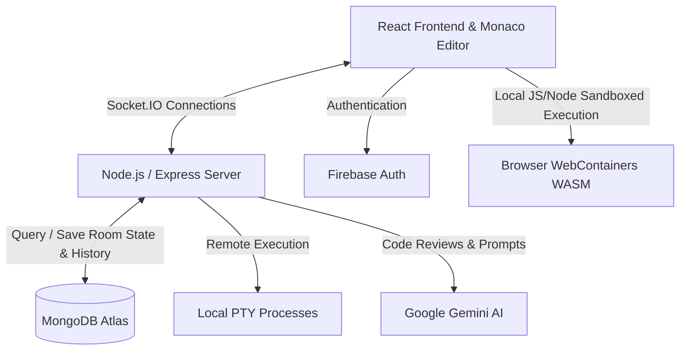

# CodeFusionAI 🚀

[](https://opensource.org/licenses/ISC)
[](https://react.dev/)
[](https://vite.dev/)
[](https://nodejs.org/)
[](https://expressjs.com/)
[](https://socket.io/)
[](https://www.mongodb.com/)
[](https://firebase.google.com/)
[](https://deepmind.google/technologies/gemini/)

CodeFusionAI is a state-of-the-art, web-based, AI-powered real-time collaborative development environment. It brings the power of IDEs into the browser, enabling developers to write, compile, run, and review code collaboratively in real time, backed by Google's Gemini AI.

---

## 🌟 Key Features

*   **👥 Real-Time Collaboration:** Synchronized multi-user editing powered by Socket.IO. Join or create rooms instantly and see other participants' edits as they happen.
*   **💻 VS Code-Grade Editor:** Built using Microsoft's **Monaco Editor** for syntax highlighting, multi-language support, search, autocomplete, and code formatting.
*   **⚡ Dual Execution Engine:**
    *   **Client-Side Sandboxing (WebContainers):** Execute Node.js scripts, React, Svelte, and Vue applications directly inside a secure WebAssembly browser sandbox using the WebContainer API.
    *   **Server-Side Execution:** Compile and execute traditional languages like Python, C++, and Java securely using server-side host interpreters.
*   **🐚 Terminal Console:** Integrated interactive terminal powered by **Xterm.js** to run shell commands, interact with CLI tools, and view execution outputs in real time.
*   **🤖 Google Gemini AI Integration:**
    *   **AI Code Review:** Automated complexity analysis (Time & Space), bug detection, and code optimization suggestions.
    *   **AI Chat Assistant:** Interactive coding companion with full chat history, context-aware bug fixing, and test-case generation.
*   **🔒 Secure Authentication:** Fully integrated with **Firebase Authentication** supporting Google Sign-In and traditional email/password credentials.
*   **📜 Code History Management:** Periodic snapshots of codebase states allowing rooms to compare, review, and restore previous versions.

---

## 🛠️ Technology Stack

| Layer | Technologies |
| :--- | :--- |
| **Frontend UI/UX** | React (v19), Tailwind CSS, Vite |
| **Editor & Shell** | Monaco Editor, Xterm.js, WebContainer API |
| **Backend & APIs** | Node.js, Express.js, Socket.IO |
| **Database** | MongoDB Atlas, Mongoose |
| **Authentication** | Firebase Auth |
| **Artificial Intelligence** | Gemini API (`@google/generative-ai`) |

---

## 📐 Architecture Overview

CodeFusionAI uses a hybrid client-server execution and synchronization system:



*For a detailed design overview, see [docs/Architecture.png](docs/Architecture.png).*

---

## 📂 Project Structure

```text
CodeFusionAI/
├── Backend/                 # Express Server & Socket.IO Handler
│   ├── src/
│   │   ├── config/          # DB Connection Configuration
│   │   ├── controllers/     # Socket and API controller logic
│   │   ├── models/          # MongoDB Mongoose schemas
│   │   ├── routes/          # Express API route endpoints
│   │   ├── services/        # AI & backend utility services
│   │   └── server.js        # Server entry point
│   └── package.json
├── Frontend/                # React App & Client Components
│   ├── src/
│   │   ├── components/      # Monaco Editor, Terminal, AI Panel, etc.
│   │   ├── context/         # React Context state management
│   │   ├── firebase/        # Firebase Auth configuration
│   │   ├── pages/           # Login, Dashboard, Room, and 3D Visualizer
│   │   └── main.jsx         # Application entry point
│   ├── package.json
│   ├── vite.config.js
│   └── tailwind.config.js
└── docs/                    # Requirements, architectural diagrams & assets
```

---

## 🚀 Getting Started

Follow these steps to run CodeFusionAI locally on your system.

### Prerequisites

*   [Node.js](https://nodejs.org/) (v18.0.0 or higher recommended)
*   [MongoDB Atlas](https://www.mongodb.com/cloud/atlas) database
*   [Gemini API Key](https://aistudio.google.com/) for AI assistant features
*   [Firebase Project](https://console.firebase.google.com/) for authentication

---

### Step 1: Clone the Repository & Configure Backend

1. Clone the repository and navigate into the `Backend` directory:
   ```bash
   git clone https://github.com/Manudeep06/CodeFusionAi.git
   cd CodeFusionAi/Backend
   ```

2. Install dependencies:
   ```bash
   npm install
   ```

3. Create a `.env` file in the `Backend` directory:
   ```env
   PORT=5000
   FRONTEND_URL=http://localhost:5173
   MONGO_URI=your_mongodb_atlas_connection_string
   GEMINI_API_KEY=your_gemini_api_key
   ```

4. Run the development backend server:
   ```bash
   npm run dev
   ```
   The backend will start running at `http://localhost:5000`.

---

### Step 2: Configure & Launch Frontend

1. Navigate to the `Frontend` directory:
   ```bash
   cd ../Frontend
   ```

2. Install dependencies:
   ```bash
   npm install
   ```

3. Create a `.env` file in the `Frontend` directory:
   ```env
   VITE_BACKEND_URL=http://localhost:5000
   VITE_API_URL=http://localhost:5000/api/ai
   VITE_STACKBLITZ_API_KEY=your_optional_webcontainer_key
   ```

4. Configure your Firebase project details in `Frontend/src/firebase/firebase.js`.

5. Launch the React development server:
   ```bash
   npm run dev
   ```
   The client application will start at `http://localhost:5173`.

---

## 🔒 Security & Deployment Notes

*   **API Security:** Ensure that backend environment variables (`MONGO_URI`, `GEMINI_API_KEY`) are kept secret and never checked into source control.
*   **WebContainer Requirements:** Running WebContainers requires setting COOP (Cross-Origin-Opener-Policy) and COEP (Cross-Origin-Embedder-Policy) headers on your web servers if deployed in production. The repository includes configurations for Vercel (`vercel.json`) and Netlify (`netlify.toml`) containing the headers needed to enable these sandbox features.

---

## 📄 License

This project is licensed under the **ISC License**. Feel free to use, modify, and distribute it in accordance with the license.
