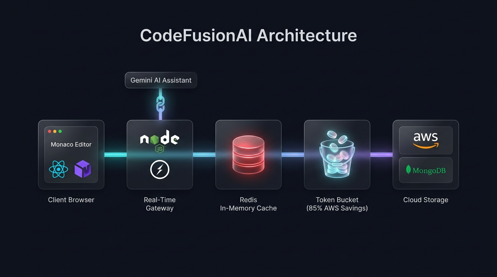
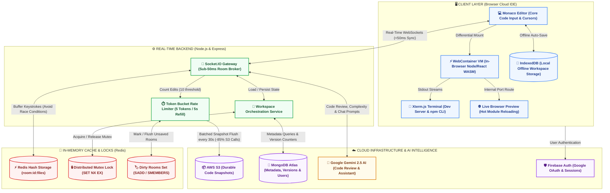

# CodeFusionAI 🚀

[](https://opensource.org/licenses/ISC)
[](https://react.dev/)
[](https://vite.dev/)
[](https://nodejs.org/)
[](https://expressjs.com/)
[](https://socket.io/)
[](https://redis.io/)
[](https://aws.amazon.com/s3/)
[](https://www.mongodb.com/)
[](https://firebase.google.com/)
[](https://deepmind.google/technologies/gemini/)

CodeFusionAI is a state-of-the-art, web-based, AI-powered real-time collaborative development environment. It brings the power of full-stack IDEs into the browser, enabling developers to write, compile, run, and review full-stack **MERN** applications collaboratively in real time with sub-50ms sync latency, backed by Google's Gemini AI.

---

## 🌟 Key Features

*   **👥 Real-Time Collaboration (<50ms Latency):** Sub-50ms synchronized multi-user code editing and collaborative cursor tracking powered by **Socket.IO** and Microsoft’s **Monaco Editor**. Join or create rooms instantly and see teammates' keystrokes, active files, and presence indicators in real time.
*   **⚡ In-Browser MERN Execution (WebContainers WASM):** Execute full-stack JavaScript, Node.js, Express, and React projects directly inside the browser using the **WebContainer API** (WebAssembly). Install npm packages, run development servers, and view instant live previews with zero server compute overhead.
*   **🐚 Interactive Terminal Console:** Integrated shell console powered by **Xterm.js** with `FitAddon` to run npm commands (`npm install`, `npm run dev`), inspect build outputs, and monitor dev server logs.
*   **🚀 3-Tier Caching & S3 Cost Optimization:** 
    *   **Per-File Redis Hash Storage:** Stores each file as an independent Redis Hash field (`HSET room:{id}:files`), eliminating workspace-level last-write-wins race conditions during simultaneous multi-file editing.
    *   **Token Bucket Rate Limiting:** A custom token bucket algorithm buffers live edits in Redis memory and batches snapshot writes to **AWS S3** every 30 seconds or 10 edits, reducing cloud S3 API calls by over **85%**.
    *   **Distributed Mutex Locking:** Uses Redis distributed locks (`SET NX EX`) to guarantee concurrency safety and prevent double-persisting.
*   **🤖 Google Gemini AI Integration:**
    *   **AI Code Review:** Automated algorithmic time & space complexity analysis, security vulnerability audits, and bug detection.
    *   **AI Pair Programming:** Context-aware chat companion with multi-turn conversation memory, code explanation, and one-click code optimization.
*   **💾 Offline-First Resilience (IndexedDB):** Automatically caches workspace files in the browser's **IndexedDB**, ensuring zero data loss and instant code recovery if a user accidentally refreshes the tab or disconnects from the network.
*   **🔒 Secure Authentication & Access Control:** Integrated with **Firebase Authentication** supporting Google OAuth and traditional credentials, with room-level privacy controls (private vs. public sessions).

---

## 🛠️ Technology Stack

| Layer | Technologies | Role in System |
| :--- | :--- | :--- |
| **Frontend UI/UX** | React 19, Vite, Tailwind CSS | Responsive, dark/light cloud IDE interface with resizable multi-pane layout |
| **Editor & Shell** | Monaco Editor, Xterm.js | Code editing, syntax highlighting, keyboard shortcuts, and interactive terminal |
| **Client Runtime** | WebContainers (WASM) | In-browser Node.js/React compilation, npm package management, live preview |
| **Offline Storage** | IndexedDB (`idb`) | Browser-native asynchronous workspace caching & instant refresh recovery |
| **Real-Time Sync** | Socket.IO | Persistent full-duplex WebSockets for sub-50ms peer-to-peer code & cursor sync |
| **Backend & APIs** | Node.js, Express.js | Session management, REST endpoints, and orchestration service layer |
| **In-Memory Cache** | Redis (ioredis) | Per-file hash caching, distributed mutex locking, Token Bucket rate limiting |
| **Cloud Storage** | AWS S3 (`@aws-sdk/client-s3`) | Durable object storage for room file snapshots and workspace persistence |
| **Database** | MongoDB Atlas, Mongoose | User profiles, room metadata, session history, and workspace document indexing |
| **Authentication** | Firebase Auth | Google OAuth 2.0 and email/password credential management |
| **AI Intelligence** | Google Gemini API (`gemini-2.5-flash`) | Automated code review, complexity analysis, debugging, and chat assistance |

---

## 📐 Architecture Overview



CodeFusionAI uses a high-performance, client-server collaborative architecture with in-memory caching and client-side WebAssembly execution:


```mermaid
flowchart TB
    %% ─── STYLING DEFINITIONS ──────────────────────────────
    classDef client fill:#EFF6FF,stroke:#3B82F6,stroke-width:2px,color:#1E3A8A,font-weight:600;
    classDef server fill:#F0FDF4,stroke:#16A34A,stroke-width:2px,color:#14532D,font-weight:600;
    classDef cache fill:#FEF2F2,stroke:#DC2626,stroke-width:2px,color:#7F1D1D,font-weight:600;
    classDef cloud fill:#FAF5FF,stroke:#9333EA,stroke-width:2px,color:#581C87,font-weight:600;
    classDef ai fill:#FFFBEB,stroke:#D97706,stroke-width:2px,color:#78350F,font-weight:600;

    %% ─── CLIENT TIER ─────────────────────────────────────
    subgraph ClientTier ["🖥️ CLIENT LAYER (Browser Cloud IDE)"]
        Monaco["💻 Monaco Editor (Core Code Input & Cursors)"]:::client
        WebContainer["⚡ WebContainer VM (In-Browser Node/React WASM)"]:::client
        Xterm["🐚 Xterm.js Terminal (Dev Server & npm CLI)"]:::client
        Preview["🌐 Live Browser Preview (Hot Module Reloading)"]:::client
        IDB[("💾 IndexedDB (Local Offline Workspace Storage)")]:::client

        Monaco <-->|"Offline Auto-Save"| IDB
        Monaco -->|"Differential Mount"| WebContainer
        WebContainer -->|"Stdout Streams"| Xterm
        WebContainer -->|"Internal Port Route"| Preview
    end

    %% ─── SERVER TIER ─────────────────────────────────────
    subgraph ServerTier ["⚙️ REAL-TIME BACKEND (Node.js & Express)"]
        SocketGateway["🔌 Socket.IO Gateway (Sub-50ms Room Broker)"]:::server
        WorkspaceManager["📁 Workspace Orchestration Service"]:::server
        TokenBucketEngine["⏱️ Token Bucket Rate Limiter (5 Tokens / 5s Refill)"]:::server

        SocketGateway -->|"Count Edits (10 threshold)"| TokenBucketEngine
        SocketGateway <-->|"Load / Persist State"| WorkspaceManager
    end

    %% ─── CACHE TIER ──────────────────────────────────────
    subgraph CacheTier ["🚀 IN-MEMORY CACHE & LOCKS (Redis)"]
        RedisHash[("⚡ Redis Hash Storage (room:id:files)")]:::cache
        RedisLocks[("🔒 Distributed Mutex Lock (SET NX EX)")]:::cache
        DirtySet[("🏷️ Dirty Rooms Set (SADD / SMEMBERS)")]:::cache

        WorkspaceManager <-->|"Acquire / Release Mutex"| RedisLocks
        TokenBucketEngine <-->|"Mark / Flush Unsaved Rooms"| DirtySet
    end

    %% ─── CLOUD & AI TIER ─────────────────────────────────
    subgraph CloudTier ["☁️ CLOUD INFRASTRUCTURE & AI INTELLIGENCE"]
        S3[("📦 AWS S3 (Durable Code Snapshots)")]:::cloud
        Mongo[("🍃 MongoDB Atlas (Metadata, Versions & Users)")]:::cloud
        Gemini["🤖 Google Gemini 2.5 AI (Code Review & Assistant)"]:::ai
        Firebase["🛡️ Firebase Auth (Google OAuth & Sessions)"]:::cloud
    end

    %% ─── CROSS-TIER PIPELINES ────────────────────────────
    Monaco <-->|"Real-Time WebSockets (<50ms Sync)"| SocketGateway
    ClientTier -->|"User Authentication"| Firebase
    SocketGateway <-->|"Buffer Keystrokes (Avoid Race Conditions)"| RedisHash
    TokenBucketEngine -->|"Batched Snapshot Flush every 30s (-85% S3 Calls)"| S3
    WorkspaceManager <-->|"Metadata Queries & Version Counters"| Mongo
    SocketGateway <-->|"Code Review, Complexity & Chat Prompts"| Gemini
```

---

## 📂 Project Structure

```text
CodeFusionAI/
├── Backend/                 # Express Server & Socket.IO Handler
│   ├── src/
│   │   ├── config/          # MongoDB, Redis, AWS S3, & Gemini SDK setup
│   │   ├── controllers/     # Socket and REST API controller logic
│   │   ├── middleware/      # Error handling and validation middlewares
│   │   ├── models/          # MongoDB Mongoose schemas (Room, File, UserProfile)
│   │   ├── routes/          # Express API route endpoints
│   │   ├── services/        # Workspace, Redis, S3, Room, & Gemini services
│   │   ├── utils/           # Redis key patterns & Token Bucket configuration
│   │   └── server.js        # Server entry point & background sync intervals
│   └── package.json
├── Frontend/                # React App & Client Components
│   ├── src/
│   │   ├── components/      # Monaco Editor, Xterm Terminal, AI Panel, Modals
│   │   ├── context/         # AuthContext state management
│   │   ├── firebase/        # Firebase Auth configuration
│   │   ├── pages/           # Login, Dashboard, Room, and Architecture Views
│   │   ├── services/        # WebContainer manager, IndexedDB, Socket client
│   │   └── main.jsx         # Application entry point
│   ├── package.json
│   ├── vite.config.js
│   └── tailwind.config.js
└── docs/                    # Requirements, architectural diagrams & assets
```

---

## 🚀 Getting Started

Follow these steps to run CodeFusionAI locally on your system.

### Prerequisites

*   [Node.js](https://nodejs.org/) (v18.0.0 or higher)
*   [Redis](https://redis.io/) (Local instance or [Upstash Redis](https://upstash.com/))
*   [MongoDB Atlas](https://www.mongodb.com/cloud/atlas) database
*   [AWS S3](https://aws.amazon.com/s3/) bucket for persistent storage
*   [Gemini API Key](https://aistudio.google.com/) for AI assistant features
*   [Firebase Project](https://console.firebase.google.com/) for authentication

---

### Step 1: Configure & Launch Backend

1. Clone the repository and navigate into the `Backend` directory:
   ```bash
   git clone https://github.com/Manudeep06/CodeFusionAi.git
   cd CodeFusionAi/Backend
   ```

2. Install dependencies:
   ```bash
   npm install
   ```

3. Create a `.env` file in the `Backend` directory:
   ```env
   PORT=5000
   FRONTEND_URL=http://localhost:5173
   MONGO_URI=your_mongodb_atlas_connection_string
   REDIS_URL=redis://localhost:6379
   GEMINI_API_KEY=your_gemini_api_key

   # AWS S3 Configuration
   AWS_ACCESS_KEY_ID=your_aws_access_key
   AWS_SECRET_ACCESS_KEY=your_aws_secret_key
   AWS_REGION=your_aws_region
   AWS_S3_BUCKET=your_s3_bucket_name
   ```

4. Run the development backend server:
   ```bash
   npm run dev
   ```
   The backend will start running at `http://localhost:5000`.

---

### Step 2: Configure & Launch Frontend

1. Navigate to the `Frontend` directory:
   ```bash
   cd ../Frontend
   ```

2. Install dependencies:
   ```bash
   npm install
   ```

3. Create a `.env` file in the `Frontend` directory:
   ```env
   VITE_BACKEND_URL=http://localhost:5000
   VITE_API_URL=http://localhost:5000/api/ai

   # Firebase Configuration
   VITE_FIREBASE_API_KEY=your_firebase_api_key
   VITE_FIREBASE_AUTH_DOMAIN=your_firebase_auth_domain
   VITE_FIREBASE_PROJECT_ID=your_firebase_project_id
   VITE_FIREBASE_STORAGE_BUCKET=your_firebase_storage_bucket
   VITE_FIREBASE_MESSAGING_SENDER_ID=your_firebase_messaging_sender_id
   VITE_FIREBASE_APP_ID=your_firebase_app_id
   VITE_FIREBASE_MEASUREMENT_ID=your_firebase_measurement_id
   ```

4. Launch the React development server:
   ```bash
   npm run dev
   ```
   The client application will start at `http://localhost:5173`.

---

## 🔒 Security & Deployment Notes

*   **API Security:** Ensure backend environment variables (`MONGO_URI`, `REDIS_URL`, `AWS_ACCESS_KEY_ID`, `GEMINI_API_KEY`) are kept secret and never committed to source control.
*   **WebContainer Requirements:** Running WebContainers requires setting COOP (`Cross-Origin-Opener-Policy: same-origin`) and COEP (`Cross-Origin-Embedder-Policy: require-corp`) headers on your web servers in production (configured in `vite.config.js`, `vercel.json`, and `netlify.toml`).

---

## 📄 License

This project is licensed under the **ISC License**. Feel free to use, modify, and distribute it in accordance with the license.
